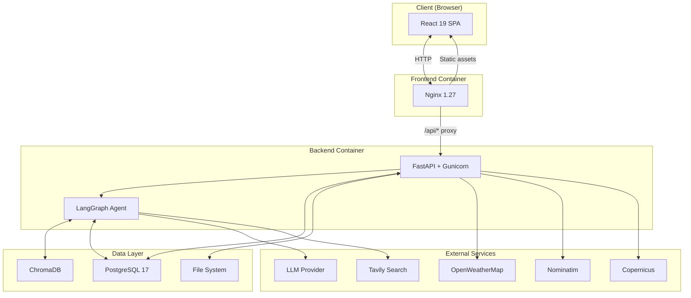
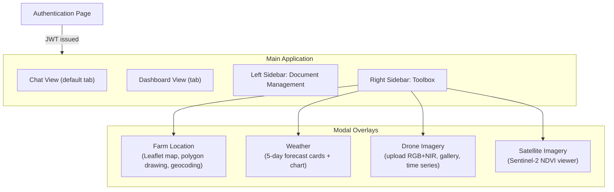
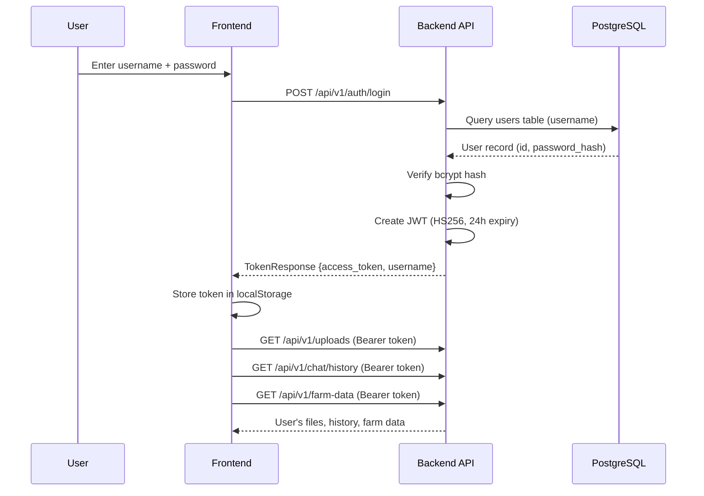
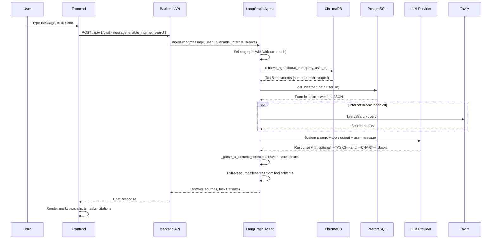
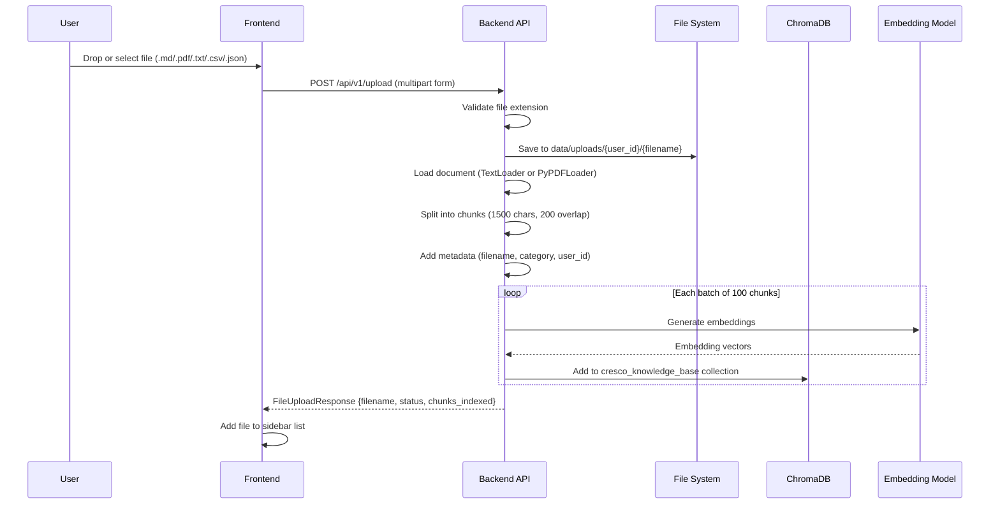
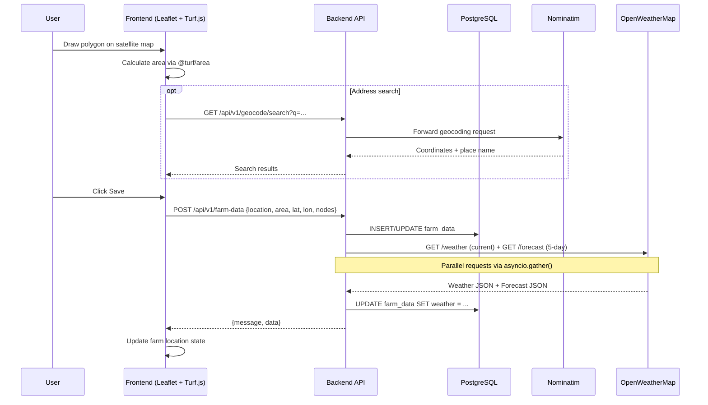
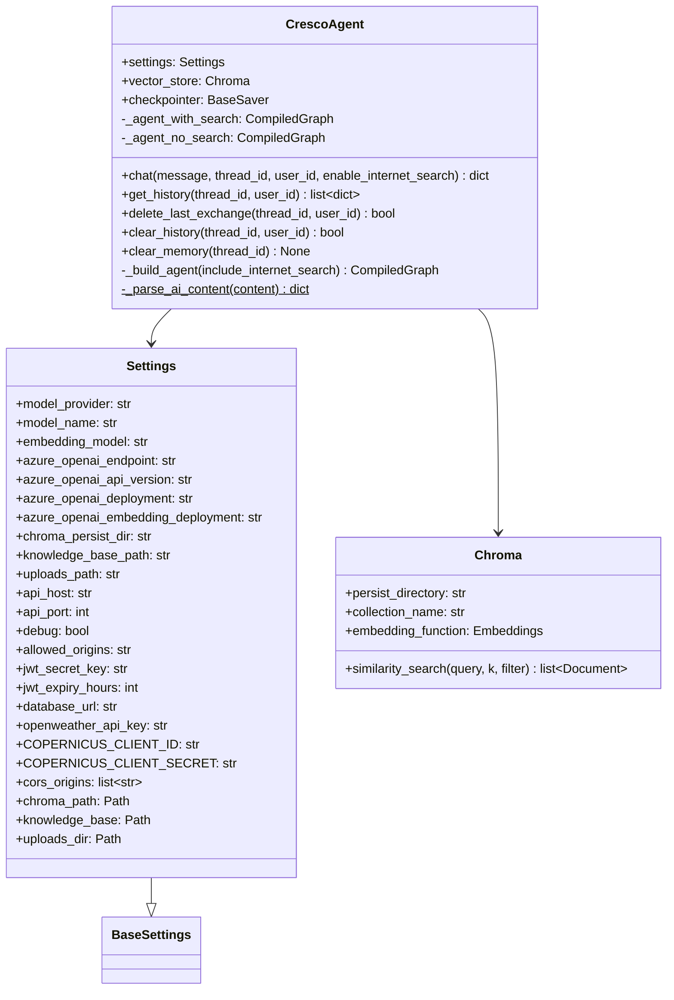
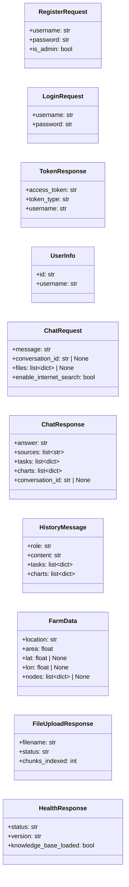
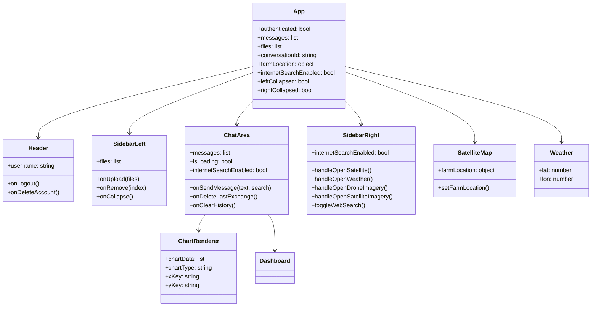

# System Design

## 1. System Architecture

### 1.1 Architecture Diagram



### 1.2 Component Descriptions

| Component               | Technology                                                      | Responsibility                                                                                                                                                                    |
| ----------------------- | --------------------------------------------------------------- | --------------------------------------------------------------------------------------------------------------------------------------------------------------------------------- |
| Frontend SPA            | React 19, Vite                                                  | Single-page application providing the chat interface, dashboard, interactive map, and drone/satellite imagery panels.                                                             |
| Reverse Proxy           | Nginx 1.27 Alpine                                               | Serves static frontend assets and proxies `/api/` requests to the backend. Handles SPA routing via `try_files $uri /index.html`.                                                  |
| API Server              | FastAPI, Gunicorn (2 Uvicorn workers, 120s timeout)             | REST API layer handling authentication, file management, farm data CRUD, and proxying third-party API calls. All external API calls are made server-side.                         |
| AI Agent                | LangGraph, LangChain                                            | RAG-powered conversational agent with three tools: knowledge base retrieval, weather data, and optional internet search. Parses structured task and chart blocks from LLM output. |
| Vector Store            | ChromaDB                                                        | Stores document embeddings for similarity search. Pre-built index baked into the Docker image; user uploads indexed at runtime with per-user metadata scoping.                    |
| Database                | PostgreSQL 17                                                   | Stores user accounts, farm data (with JSONB for polygon nodes and weather), and LangGraph conversation checkpoints. Accessed via an async connection pool (min 2, max 10).        |
| File System             | Docker volumes                                                  | Stores user-uploaded documents (`data/uploads/{user_id}/`) and computed drone vegetation index images (`data/ndvi_images/`).                                                      |
| LLM Provider            | Azure OpenAI (default), OpenAI, Google GenAI, Anthropic, Ollama | Provides chat model inference and text embeddings. Configurable via `MODEL_PROVIDER` and `MODEL_NAME` environment variables.                                                      |
| OpenWeatherMap          | REST API                                                        | Supplies current weather conditions and 5-day forecasts for farm coordinates.                                                                                                     |
| Nominatim               | REST API (OpenStreetMap)                                        | Forward geocoding (address to coordinates) and reverse geocoding (coordinates to place name).                                                                                     |
| Copernicus Sentinel Hub | REST API                                                        | Fetches Sentinel-2 satellite imagery for server-side NDVI computation.                                                                                                            |
| Tavily Search           | LangChain tool                                                  | Real-time internet search, conditionally included in the agent's tool set based on user toggle.                                                                                   |

---

## 2. Site Map



**Authentication Page** — Login and registration forms. On successful authentication, a JWT is stored in `localStorage` and the user is redirected to the main application.

**Chat View** — Default view. Displays the message history with markdown rendering, inline Recharts charts, colour-coded task cards, and source citations. The input area includes a text field and an internet search toggle.

**Dashboard View** — Accessible via a tab. Aggregates 5-day weather forecast, seasonal context, active tasks from chat responses, and a field health NDVI chart from drone imagery history.

**Left Sidebar** — Document management panel. Supports file upload (click or drag-and-drop) for `.md`, `.pdf`, `.txt`, `.csv`, and `.json` files. Lists uploaded files with type icons and deletion controls.

**Right Sidebar** — Toolbox with buttons for Farm Location, Weather, Drone Monitoring, Satellite Imagery, and Web Search toggle. Each button opens its corresponding modal overlay.

**Modal Overlays** — Full-screen overlays for interactive tools: farm polygon drawing on a satellite map, weather forecast display, drone image upload and gallery, and satellite NDVI viewer.

---

## 3. Sequence Diagrams

### 3.1 User Authentication



### 3.2 Chat with RAG



### 3.3 File Upload and Indexing



### 3.4 Farm Location and Weather



---

## 4. Design Patterns

### 4.1 Singleton

Two singleton variants are used to ensure expensive resources are initialised once per process.

**LRU cache singleton** (`config.py`): The `get_settings()` function uses `@lru_cache` to create a single `Settings` instance. Tests reset it via `get_settings.cache_clear()`.

**Module-level singleton** (`agent.py`, `embeddings.py`, `retriever.py`): A module-level `_variable = None` is lazily initialised by a `get_*()` function. This pattern is used for the `CrescoAgent`, `AzureOpenAIEmbeddings`, `Chroma` vector store, and retriever instances. Tests reset them by setting the module variable to `None`.

### 4.2 Factory

`create_app()` in `main.py` is a factory function that constructs and returns a fully configured FastAPI application with CORS middleware, routers, and a lifespan manager. This separates application construction from the module-level `app` instance, enabling test clients to create isolated app instances.

### 4.3 Strategy

The `CrescoAgent` pre-builds two LangGraph agents at initialisation: `_agent_with_search` (includes Tavily) and `_agent_no_search` (excludes Tavily, appends a "search disabled" addendum to the prompt). The `chat()` method selects the appropriate agent at runtime based on the user's `enable_internet_search` flag, avoiding the overhead of rebuilding the graph on every request.

### 4.4 Dependency Injection

FastAPI's `Depends()` mechanism injects shared resources into route handlers:

- `get_db_pool(request)` — extracts the async connection pool from `app.state`
- `get_agent_dep(request)` — passes the checkpointer from `app.state` to `get_agent()`
- `get_current_user(credentials)` — validates the JWT Bearer token and returns user identity
- `get_current_admin(current_user)` — chains on `get_current_user` and enforces admin role
- `get_settings()` — injects the cached settings instance

This allows routes to declare their dependencies declaratively and enables tests to override them via `app.dependency_overrides`.

### 4.5 Proxy

All third-party API calls (OpenWeatherMap, Nominatim, Copernicus) are proxied through backend endpoints using `httpx.AsyncClient`. The frontend never contacts external services directly. This keeps API keys server-side (NFR-02) and provides a single point for timeout enforcement, error handling, and response transformation.

### 4.6 Repository

The `db.py` module provides a functional repository interface over PostgreSQL. Async functions (`save_farm_data`, `get_farm_data`, `update_farm_weather`) accept a connection pool as the first argument and encapsulate all SQL queries. A separate sync function (`get_farm_data_sync`) serves the agent tool, which runs in a LangGraph thread pool where async calls are not available.

---

## 5. Class Diagrams

### 5.1 Backend Classes



### 5.2 Pydantic Request/Response Models



### 5.3 Frontend Component Hierarchy



---

## 6. Data Storage

### 6.1 PostgreSQL

PostgreSQL 17 stores relational data across two application tables and auto-generated LangGraph checkpointer tables.

**Table: `users`**

```sql
CREATE TABLE users (
    id            TEXT PRIMARY KEY,
    username      TEXT UNIQUE NOT NULL,
    password_hash TEXT NOT NULL,
    is_admin      BOOLEAN NOT NULL DEFAULT FALSE,
    created_at    TIMESTAMPTZ NOT NULL
);
```

Passwords are hashed with bcrypt before storage. The `id` field is a UUID generated at registration time.

**Table: `farm_data`**

```sql
CREATE TABLE farm_data (
    user_id  TEXT PRIMARY KEY,
    location TEXT,
    area     DOUBLE PRECISION,
    lat      DOUBLE PRECISION,
    lon      DOUBLE PRECISION,
    nodes    JSONB,
    weather  JSONB
);
```

The `nodes` column stores the farm polygon boundary as a JSONB array of `{lat, lng}` objects. The `weather` column caches the most recent OpenWeatherMap response (current conditions and 5-day forecast) to make it available to the agent's weather tool without an API call.

**LangGraph Checkpointer Tables** — Auto-created by `AsyncPostgresSaver.setup()`. Stores serialised conversation state (all messages, tool calls, and tool responses) keyed by `thread_id`, enabling conversation persistence across server restarts.

### 6.2 ChromaDB

ChromaDB provides the vector store for Retrieval-Augmented Generation.

| Property           | Value                                                                                               |
| ------------------ | --------------------------------------------------------------------------------------------------- |
| Collection         | `cresco_knowledge_base`                                                                             |
| Embedding model    | Azure OpenAI `text-embedding-ada-002` (configurable)                                                |
| Chunk size         | 1500 characters, 200 character overlap                                                              |
| Splitter           | `RecursiveCharacterTextSplitter` with separators: section breaks, headers, paragraphs, lines, words |
| Search type        | MMR (Maximum Marginal Relevance), k=5, fetch_k=10                                                   |
| Metadata per chunk | `filename`, `category`, `user_id`, `chunk_index`                                                    |

Document scoping uses the `user_id` metadata field. Shared knowledge base documents are tagged with `user_id = "__shared__"`. User uploads are tagged with the user's UUID. The retrieval tool filters with `$or: [user_id == "__shared__", user_id == current_user]` to return both shared and user-specific documents.

### 6.3 File System

| Path                      | Contents                                                       | Lifecycle                                                        |
| ------------------------- | -------------------------------------------------------------- | ---------------------------------------------------------------- |
| `data/knowledge_base/`    | Shared agricultural knowledge base documents (.md, .pdf, .txt) | Baked into Docker image at build time                            |
| `data/chroma_db/`         | Pre-built ChromaDB index over the knowledge base               | Baked into Docker image at build time                            |
| `data/uploads/{user_id}/` | User-uploaded documents                                        | Created at runtime; deleted on file removal or account deletion  |
| `data/ndvi_images/`       | Computed drone vegetation index images with JSON metadata      | Created at runtime; deleted on image removal or account deletion |

---

## 7. Packages and APIs

### 7.1 Key Packages

**Backend (Python 3.12):**

| Package                        | Version                 | Purpose                                                      |
| ------------------------------ | ----------------------- | ------------------------------------------------------------ |
| fastapi                        | >= 0.115                | Async REST API framework                                     |
| gunicorn + uvicorn             | >= 22.0, >= 0.32        | Production ASGI server (2 Uvicorn workers, 120s timeout)     |
| langchain + langgraph          | >= 0.3, >= 0.2          | LLM orchestration and graph-based agent with tool use        |
| langchain-openai               | >= 0.2                  | Azure OpenAI and OpenAI chat model and embedding integration |
| langchain-chroma + chromadb    | >= 0.1, >= 0.5          | Vector store for RAG document retrieval                      |
| langchain-tavily               | >= 0.2                  | Internet search tool for the agent                           |
| psycopg[binary,pool]           | >= 3.2                  | Async PostgreSQL driver with connection pooling              |
| langgraph-checkpoint-postgres  | >= 2.0                  | LangGraph conversation state persistence in PostgreSQL       |
| pyjwt[crypto] + bcrypt         | >= 2.8, >= 4.1          | JWT token creation/validation and password hashing           |
| httpx                          | >= 0.27                 | Async HTTP client for proxying third-party APIs              |
| rasterio + pillow + matplotlib | >= 1.3, >= 10.0, >= 3.0 | Drone and satellite image processing                         |
| pydantic-settings              | >= 2.0                  | Environment variable configuration via `.env`                |
| pypdf                          | >= 4.0                  | PDF document loading for the knowledge base                  |

**Frontend (Node 22):**

| Package                         | Version   | Purpose                                             |
| ------------------------------- | --------- | --------------------------------------------------- |
| react + react-dom               | 19.2      | UI framework                                        |
| vite                            | 7.2       | Build tool and development server                   |
| leaflet + react-leaflet         | 1.9, 5.0  | Interactive satellite map with polygon drawing      |
| recharts                        | 3.7       | Chart rendering (bar, line, pie) inline in chat     |
| react-markdown                  | 10.1      | Markdown rendering for AI responses                 |
| remark-gfm + remark-math        | 4.0, 6.0  | GitHub Flavoured Markdown and math notation plugins |
| rehype-katex + katex            | 7.0, 0.16 | LaTeX math typesetting                              |
| @turf/area + @turf/helpers      | —         | GeoJSON polygon area calculation                    |
| lucide-react                    | 0.562     | Icon library                                        |
| vitest + @testing-library/react | 4.0, 16.3 | Unit testing framework                              |

### 7.2 API Endpoints

All endpoints are served under `/api/v1`. Endpoints marked with a lock require a valid JWT Bearer token.

**Authentication**

| Method | Path             | Description                 | Auth |
| ------ | ---------------- | --------------------------- | ---- |
| POST   | `/auth/register` | Create account, returns JWT | No   |
| POST   | `/auth/login`    | Authenticate, returns JWT   | No   |
| DELETE | `/auth/me`       | Delete own account          | Yes  |

**Chat**

| Method | Path                  | Description                                                 | Auth |
| ------ | --------------------- | ----------------------------------------------------------- | ---- |
| POST   | `/chat`               | Send message, returns AI response with tasks/charts/sources | Yes  |
| GET    | `/chat/history`       | Fetch full conversation history                             | Yes  |
| DELETE | `/chat/history`       | Clear all conversation history                              | Yes  |
| DELETE | `/chat/last-exchange` | Remove the last question-answer pair                        | Yes  |

**Farm Data**

| Method | Path         | Description                           | Auth |
| ------ | ------------ | ------------------------------------- | ---- |
| POST   | `/farm-data` | Save farm location, polygon, and area | Yes  |
| GET    | `/farm-data` | Retrieve saved farm data              | Yes  |

**Weather and Geocoding**

| Method | Path                         | Description                                                            | Auth |
| ------ | ---------------------------- | ---------------------------------------------------------------------- | ---- |
| GET    | `/weather?lat=&lon=`         | Fetch current weather and 5-day forecast (proxied from OpenWeatherMap) | Yes  |
| GET    | `/geocode/search?q=`         | Forward geocoding (proxied from Nominatim)                             | Yes  |
| GET    | `/geocode/reverse?lat=&lon=` | Reverse geocoding (proxied from Nominatim)                             | Yes  |

**File Management**

| Method | Path                 | Description                         | Auth |
| ------ | -------------------- | ----------------------------------- | ---- |
| POST   | `/upload`            | Upload and auto-index a document    | Yes  |
| GET    | `/uploads`           | List uploaded files                 | Yes  |
| DELETE | `/upload/{filename}` | Delete file and its ChromaDB chunks | Yes  |

**Drone Imagery**

| Method | Path                           | Description                                       | Auth |
| ------ | ------------------------------ | ------------------------------------------------- | ---- |
| POST   | `/droneimage?index_type=`      | Upload RGB + NIR images, compute vegetation index | Yes  |
| GET    | `/images`                      | List saved drone analysis images                  | Yes  |
| GET    | `/images/{filename}`           | Retrieve a specific drone image                   | Yes  |
| DELETE | `/images/{filename}`           | Delete a drone image                              | Yes  |
| PATCH  | `/images/{filename}/timestamp` | Edit the capture timestamp                        | Yes  |

**Satellite and System**

| Method | Path               | Description                                 | Auth |
| ------ | ------------------ | ------------------------------------------- | ---- |
| POST   | `/satellite-image` | Fetch Sentinel-2 NDVI for farm coordinates  | Yes  |
| POST   | `/index`           | Re-index the knowledge base                 | Yes  |
| GET    | `/health`          | Health check                                | No   |
| DELETE | `/account`         | Delete user account and all associated data | Yes  |

### 7.3 External API Integrations

| API                                        | Purpose                                  | Backend Access Point                                              | Auth Method                             |
| ------------------------------------------ | ---------------------------------------- | ----------------------------------------------------------------- | --------------------------------------- |
| OpenWeatherMap                             | Current weather and 5-day forecast       | `GET /weather` proxied via `httpx`                                | API key (server-side)                   |
| Nominatim (OpenStreetMap)                  | Forward and reverse geocoding            | `GET /geocode/search`, `GET /geocode/reverse` proxied via `httpx` | None (User-Agent header)                |
| Copernicus Sentinel Hub                    | Sentinel-2 satellite imagery for NDVI    | `POST /satellite-image` via `satellite_image.py`                  | OAuth2 client credentials               |
| Tavily Search                              | Real-time internet search within agent   | Invoked as a LangGraph tool (no direct endpoint)                  | API key (server-side)                   |
| Azure OpenAI                               | Chat model inference and text embeddings | Invoked within `CrescoAgent` and `get_embeddings()`               | API key (server-side)                   |
| OpenAI / Google GenAI / Anthropic / Ollama | Alternative LLM providers                | Invoked within `CrescoAgent` via `init_chat_model()`              | Provider-specific API key (server-side) |
