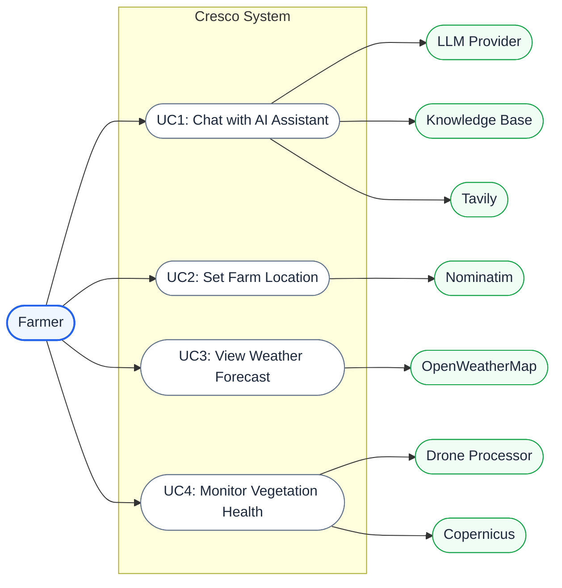

# Requirements Specification

## 1. Partner Introduction and Project Background

NTT DATA is a global digital business and IT services leader, headquartered in Tokyo, Japan, with operations in over 50 countries and approximately 190,000 employees worldwide. As one of the top 10 global IT services providers, NTT DATA partners with organisations across industries — including agriculture, government, and sustainability — to drive digital transformation through consulting, cloud infrastructure, data analytics, and AI solutions. NTT DATA has a strong presence in the UK through its London-based operations and has been actively investing in agri-tech innovation as part of its broader sustainability and smart society initiatives, recognising the potential of AI and data-driven tools to modernise traditional industries.

This project was undertaken as part of UCL's Industry Exchange Network (IXN) programme, which pairs student teams with industry partners to deliver real-world software projects. Through the IXN programme, NTT DATA proposed and sponsored the Cresco project, and providing the team with industry mentorship. NTT DATA identified UK agriculture as a domain where conversational AI and remote sensing technologies could deliver significant value to end users.

---

## 2. Project Goals

The overarching goal of Cresco is to provide an affordable and easy-to-use AI assistant for small-scale UK farmers. Large enterprises can afford dedicated agronomists and premium decision-support software, but small-scale farmers are often left relying on outdated practices or generic online searches. Cresco aims to level this playing field by offering a free, open-source tool that delivers expert guidance through a simple conversational interface, lowering the barrier to entry for AI-assisted farming.

---

## 3. Requirement Gathering

Requirements were gathered through three channels: interviews with farmers, feedback from personas (peer students acting as representative users), and ongoing communication with our client NTT DATA.

### 3.1 Interviews with Farmers

We interviewed UK farmers at different stages of development. Initial scoping interviews established the core problem: farmers need advice contextualised by weather and location, not generic textbook answers, and they lack time to search through lengthy PDFs during critical seasonal windows. After the first prototype was operational, we demonstrated it to farmers and collected feedback, which led to the addition of actionable task lists, a weather panel alongside the chat, and drone image analysis integration.

### 3.2 Persona-Based Feedback

We recruited peer students to act as personas representing our target user groups (see Section 4). They tested the application at multiple stages and provided feedback from the perspective of their assigned persona. This informed UI refinements including collapsible sidebars, the dashboard view, and the delete-last-exchange capability.

### 3.3 Client Feedback

At the end of each development sprint, a demonstration was shown to the NTT DATA project liaison, and feedback was incorporated into the next sprint's backlog. This iterative loop led to the addition of the internet search toggle, the dashboard view, and inline chart generation within chat responses.

---

## 4. Personas

### Persona 1: Small-Scale Farm Owner

### Persona 2: Large-Scale Farm Owner

---

## 5. Use Cases

### 5.1 Use Case Diagram

The following UML use case diagram illustrates the actors and relationships within the Cresco system.

### 5.2 List of Use Cases

| ID  | Use Case                   | Key Services                      | Description                                                                                                                                                                          |
| --- | -------------------------- | --------------------------------- | ------------------------------------------------------------------------------------------------------------------------------------------------------------------------------------ |
| UC1 | Chat with AI Assistant     | LLM Provider, Knowledge Base, Tavily | Send natural-language questions and receive RAG-grounded responses with source citations, task lists, and inline charts. Upload documents for retrieval. Manage conversation history. |
| UC2 | Set Farm Location          | Nominatim                         | Draw a polygon boundary on a satellite map, search by address, and save farm data with automatic geocoding.                                                                          |
| UC3 | View Weather Forecast      | OpenWeatherMap                    | Fetch and display current weather and 5-day forecast with temperature/wind charts for farm coordinates.                                                                              |
| UC4 | Monitor Vegetation Health  | Drone Processor, Copernicus       | Upload paired RGB/NIR drone images to compute vegetation indices (NDVI/EVI/SAVI) with a gallery and time series charts, and fetch Sentinel-2 satellite NDVI imagery.                 |

---

## 6. MoSCoW Requirement List

### 6.1 Functional Requirements

| ID    | Requirement                                                                                                                                                                                                                              | Priority |
| ----- | ---------------------------------------------------------------------------------------------------------------------------------------------------------------------------------------------------------------------------------------- | -------- |
| FR-01 | The system shall allow users to register and log in with a unique username and password, storing passwords as bcrypt hashes and issuing JWTs for session management.                                                                     | Must     |
| FR-02 | The system shall provide a conversational chat interface using Retrieval-Augmented Generation with ChromaDB, scoping retrieval to shared knowledge base documents and the current user's uploads, and citing sources in responses.        | Must     |
| FR-03 | The system shall persist conversation history across server restarts and allow users to delete the last exchange or clear all history.                                                                                                    | Must     |
| FR-04 | The system shall allow users to upload documents (.md, .pdf, .txt, .csv, .json), automatically chunk and index them into ChromaDB with the user's ID, so the chatbot can retrieve user-specific content.                                 | Must     |
| FR-05 | The system shall fetch current weather and a 5-day forecast from OpenWeatherMap for the user's farm coordinates and display it in a weather panel with forecast cards and a temperature/wind chart.                                      | Must     |
| FR-06 | The system shall provide an interactive Leaflet satellite map where users can draw a farm polygon boundary, calculate the enclosed area, search locations by address/postcode, and save the farm data to the database.                    | Must     |
| FR-07 | The system shall allow users to upload paired RGB and NIR drone images, compute a selected vegetation index (NDVI, EVI, or SAVI), and provide a gallery with filtering, histograms, editable timestamps, and time series visualisation.  | Should   |
| FR-08 | The system shall fetch Sentinel-2 satellite imagery from Copernicus for the user's farm coordinates and compute a server-side NDVI image for display in the frontend.                                                                    | Should   |
| FR-09 | The system shall render AI responses using GitHub Flavoured Markdown, LaTeX, and inline Recharts charts, and parse structured task and chart blocks into interactive UI components within chat messages.                                  | Should   |
| FR-10 | The system shall provide a dashboard view aggregating tasks, a 5-day weather forecast, the current season, and a field health NDVI chart from the user's drone imagery history.                                                          | Should   |
| FR-11 | The system shall provide a toggleable internet search capability (via Tavily) and allow users to permanently delete their account with cascading removal of all associated data.                                                          | Should   |
| FR-12 | The system shall support multiple LLM providers (Azure OpenAI, OpenAI, Google GenAI, Anthropic, Ollama) configurable via environment variables, drag-and-drop file upload, and collapsible sidebars.                                     | Could    |
| FR-13 | The system shall support streaming chat responses via Server-Sent Events, voice input via the Web Speech API, and PDF export of conversation history.                                                                                    | Could    |
| FR-14 | The system shall not provide a native mobile app, real-time collaborative sessions, farm management software integration, or custom LLM fine-tuning within the current project scope.                                                    | Won't    |

### 6.2 Non-Functional Requirements

| ID     | Requirement                                                                                                                                                                                                                  | Priority |
| ------ | ---------------------------------------------------------------------------------------------------------------------------------------------------------------------------------------------------------------------------- | -------- |
| NFR-01 | **Performance:** The system shall respond to chat messages within 120 seconds, including RAG retrieval and LLM inference.                                                                                                    | Must     |
| NFR-02 | **Security:** All third-party API keys shall be stored server-side; all protected endpoints shall require JWT authentication; and user passwords shall be hashed with bcrypt and never stored or returned in plaintext.       | Must     |
| NFR-03 | **Data Isolation:** All user data (documents, drone images, farm data, weather, conversation history) shall be scoped by user ID, with no endpoint returning another user's data.                                            | Must     |
| NFR-04 | **Maintainability:** The backend shall enforce 80%+ code coverage via pytest and the codebase shall comply with Ruff (backend) and ESLint (frontend) linting rules, both enforced by the CI pipeline.                        | Must     |
| NFR-05 | **Usability:** The frontend shall include ARIA labels, semantic HTML landmarks, and keyboard navigation support, targeting WCAG 2.1 Level A compliance.                                                                      | Should   |
| NFR-06 | **Performance:** The backend shall use an asynchronous database connection pool and parallel API calls to handle concurrent users efficiently.                                                                               | Should   |
| NFR-07 | **Deployability:** The system shall be deployable as Docker images orchestrated via Docker Compose, with a GitHub Actions CI/CD pipeline for automated lint, test, build, and deployment to Azure.                           | Should   |
| NFR-08 | **Extensibility:** The system shall use a provider-agnostic LLM initialisation pattern, be built entirely with open-source frameworks, and read all configuration from environment variables via a single `.env` file.        | Should   |
| NFR-09 | **Reliability:** The system shall handle errors gracefully — logging failures silently where appropriate, returning HTTP 502 for upstream API failures, and falling back to plain text when structured output parsing fails.  | Should   |
| NFR-10 | **Usability:** The frontend shall provide a dark theme for reduced eye strain and support offline access as a Progressive Web App with cached advisory content and weather data.                                              | Could    |
| NFR-11 | **Scalability/Localisation:** The system shall not support horizontal scaling with load balancing or multi-language localisation within the current project scope.                                                            | Won't    |
 