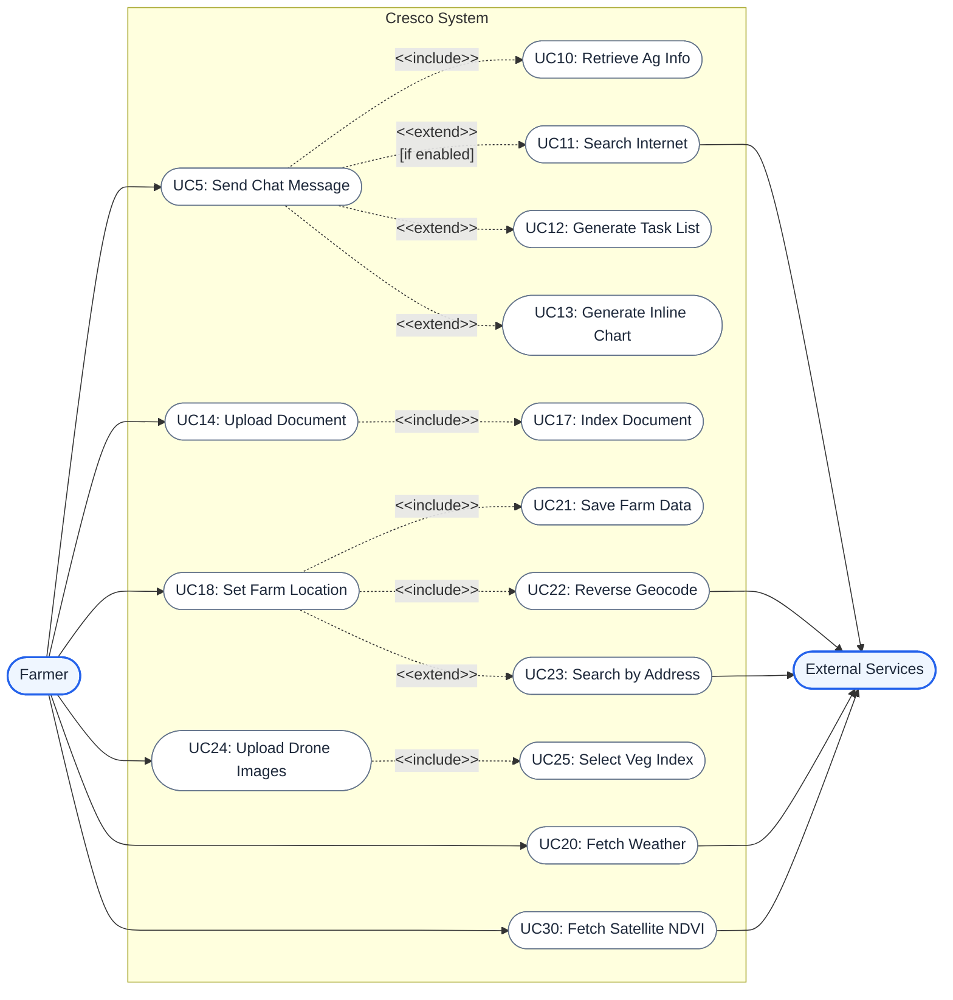

# Requirements Specification

## 1. Partner Introduction and Project Background

NTT DATA is a global digital business and IT services leader, headquartered in Tokyo, Japan, with operations in over 50 countries and approximately 190,000 employees worldwide. As one of the top 10 global IT services providers, NTT DATA partners with organisations across industries — including agriculture, government, and sustainability — to drive digital transformation through consulting, cloud infrastructure, data analytics, and AI solutions. NTT DATA has a strong presence in the UK through its London-based operations and has been actively investing in agri-tech innovation as part of its broader sustainability and smart society initiatives, recognising the potential of AI and data-driven tools to modernise traditional industries.

This project was undertaken as part of UCL's Industry Exchange Network (IXN) programme, which pairs student teams with industry partners to deliver real-world software projects. Through the IXN programme, NTT DATA proposed and sponsored the Cresco project, and providing the team with industry mentorship. NTT DATA identified UK agriculture as a domain where conversational AI and remote sensing technologies could deliver significant value to end users.

---

## 2. Project Goals

The overarching goal of Cresco is to provide an affordable and easy-to-use AI assistant for small-scale UK farmers. Large enterprises can afford dedicated agronomists and premium decision-support software, but small-scale farmers are often left relying on outdated practices or generic online searches. Cresco aims to level this playing field by offering a free, open-source tool that delivers expert guidance through a simple conversational interface, lowering the barrier to entry for AI-assisted farming.

---

## 3. Requirement Gathering

Requirements were gathered through three channels: interviews with farmers, feedback from personas (peer students acting as representative users), and ongoing communication with our client NTT DATA.

### 3.1 Interviews with Farmers

We interviewed UK farmers at different stages of development. Initial scoping interviews established the core problem: farmers need advice contextualised by weather and location, not generic textbook answers, and they lack time to search through lengthy PDFs during critical seasonal windows. After the first prototype was operational, we demonstrated it to farmers and collected feedback, which led to the addition of actionable task lists, a weather panel alongside the chat, and drone image analysis integration.

### 3.2 Persona-Based Feedback

We recruited peer students to act as personas representing our target user groups (see Section 4). They tested the application at multiple stages and provided feedback from the perspective of their assigned persona. This informed UI refinements including collapsible sidebars, the dashboard view, and the delete-last-exchange capability.

### 3.3 Client Feedback

At the end of each development sprint, a demonstration was shown to the NTT DATA project liaison, and feedback was incorporated into the next sprint's backlog. This iterative loop led to the addition of the internet search toggle, the dashboard view, and inline chart generation within chat responses.

---

## 4. Personas

### Persona 1: Sarah Mitchell — Arable Farmer

Age 42, Norfolk. Farms 280 hectares of winter wheat, spring barley, and oilseed rape. Moderate technology comfort — uses a smartphone and spreadsheets but no AI tools. Sarah wants quick answers to crop disease and spraying timing questions contextualised by her local weather, without searching through PDFs. She would use Cresco daily during the growing season, setting her farm location, checking weather, and uploading soil analysis data.

### Persona 2: James O'Brien — Mixed Farmer and Early Tech Adopter

Age 31, Herefordshire. Farms 120 hectares of cereals and 60 head of beef cattle. High technology comfort — flies a DJI Mavic with a multispectral camera. James wants to integrate drone NDVI analysis with advisory knowledge in one platform rather than using three separate tools. He would upload drone imagery weekly, use satellite imagery between flights, and enable internet search for emerging threats.

### Persona 3: Dr. Helen Pryce — Agricultural Advisor

Age 55, covers farms across Cambridgeshire and Bedfordshire. High desktop comfort, moderate mobile. Helen wants to recommend Cresco to the farmers she advises, needing confidence that answers cite approved sources. She would upload region-specific advisory notes, use the dashboard before client calls, and use delete-last-exchange to correct conversations.

### Persona 4: Tom Patel — Agricultural Sciences Student

Age 22, Harper Adams University. Very high technology comfort — studies GIS, remote sensing, and data analysis. Tom wants to use Cresco as a learning tool for UK agricultural best practices and to experiment with NDVI analysis for his dissertation. He would use the chat extensively with internet search enabled and use chart generation to visualise crop data comparisons.

---

## 5. Use Cases

### 5.1 Use Case Diagram

The following UML use case diagram illustrates the actors and relationships within the Cresco system.

### 5.2 List of Use Cases

| ID   | Use Case                   | Actor(s)                  | Description                                                                                                   |
| ---- | -------------------------- | ------------------------- | ------------------------------------------------------------------------------------------------------------- |
| UC1  | Register Account           | Farmer                    | Create account with username and password; system returns a JWT.                                              |
| UC2  | Log In                     | Farmer                    | Authenticate with credentials; system validates and issues a JWT.                                             |
| UC3  | Log Out                    | Farmer                    | End session and clear stored tokens.                                                                          |
| UC4  | Delete Account             | Farmer                    | Permanently remove account with cascading deletion of all user data.                                          |
| UC5  | Send Chat Message          | Farmer                    | Submit a natural language question; receive an AI response with source citations, optional tasks, and charts. |
| UC6  | View Chat History          | Farmer                    | View persisted conversation history loaded on login.                                                          |
| UC7  | Delete Last Exchange       | Farmer                    | Remove the most recent question-answer pair from agent memory.                                                |
| UC8  | Clear All History          | Farmer                    | Remove all conversation history.                                                                              |
| UC9  | Toggle Internet Search     | Farmer                    | Enable or disable the agent's internet search capability.                                                     |
| UC10 | Retrieve Agricultural Info | Farmer, External Services | Agent searches the knowledge base via ChromaDB with per-user scoping. Included by UC5.                        |
| UC11 | Search Internet            | Farmer, External Services | Agent queries Tavily for real-time information. Extends UC5.                                                  |
| UC12 | Generate Task List         | Farmer                    | Agent produces up to 5 prioritised action tasks. Extends UC5.                                                 |
| UC13 | Generate Inline Chart      | Farmer                    | Agent produces a bar, line, or pie chart inline in the response. Extends UC5.                                 |
| UC14 | Upload Document            | Farmer                    | Upload a .md/.pdf/.txt/.csv/.json file; system auto-indexes it.                                               |
| UC15 | View Uploaded Documents    | Farmer                    | List all uploaded files with type icons and source count.                                                     |
| UC16 | Delete Uploaded Document   | Farmer                    | Remove an uploaded file and its indexed chunks from ChromaDB.                                                 |
| UC17 | Index Document             | Farmer                    | System chunks and indexes the uploaded document. Included by UC14.                                            |
| UC18 | Set Farm Location          | Farmer                    | Draw a polygon boundary on a Leaflet satellite map; area calculated via Turf.js.                              |
| UC19 | View Weather Forecast      | Farmer                    | View 5-day forecast cards and temperature/wind chart.                                                         |
| UC20 | Fetch Weather Data         | Farmer, External Services | Fetch current weather and forecast from OpenWeatherMap for farm coordinates.                                  |
| UC21 | Save Farm Data             | Farmer                    | Save farm location, area, and polygon to the database. Included by UC18.                                      |
| UC22 | Reverse Geocode Location   | Farmer, External Services | Obtain a location name from coordinates via Nominatim. Included by UC18.                                      |
| UC23 | Search Location by Address | Farmer, External Services | Search by address/postcode via Nominatim and centre the map. Extends UC18.                                    |
| UC24 | Upload Drone Images        | Farmer                    | Upload paired RGB and NIR images; system generates a vegetation index image.                                  |
| UC25 | Select Vegetation Index    | Farmer                    | Choose NDVI, EVI, or SAVI for drone image processing. Included by UC24.                                       |
| UC26 | View Image Gallery         | Farmer                    | Browse saved drone images with filtering, histograms, and timestamps.                                         |
| UC27 | Delete Drone Image         | Farmer                    | Remove a saved drone analysis image and its metadata.                                                         |
| UC28 | Edit Image Timestamp       | Farmer                    | Correct the capture date/time of a drone image.                                                               |
| UC29 | View Time Series Chart     | Farmer                    | Visualise NDVI trends over time as a stacked health bar chart.                                                |
| UC30 | Fetch Satellite NDVI       | Farmer, External Services | Fetch Sentinel-2 NDVI for farm coordinates from Copernicus. Requires UC18.                                    |

---

## 6. MoSCoW Requirement List

### 6.1 Functional Requirements

| ID    | Requirement                                                                                                                                                                                                                 | Priority |
| ----- | --------------------------------------------------------------------------------------------------------------------------------------------------------------------------------------------------------------------------- | -------- |
| FR-01 | The system shall allow users to register with a unique username and password, store the password as a bcrypt hash, and return a JWT upon successful registration.                                                           | Must     |
| FR-02 | The system shall authenticate returning users by validating credentials against stored bcrypt hashes and issuing a JWT (HS256, 24-hour expiry) for session management.                                                      | Must     |
| FR-03 | The system shall provide a conversational chat interface that accepts natural language messages and returns AI-generated responses grounded in an agricultural knowledge base, with source citations.                       | Must     |
| FR-04 | The system shall implement Retrieval-Augmented Generation using ChromaDB with a metadata filter that scopes retrieval to shared knowledge base documents and the current user's uploaded documents.                         | Must     |
| FR-05 | The system shall persist conversation history across server restarts using a PostgreSQL-backed checkpointer, so users see their full history when they log in again.                                                        | Must     |
| FR-06 | The system shall allow users to upload documents (.md, .pdf, .txt, .csv, .json), automatically chunk and index them into ChromaDB with the user's ID, so the chatbot can retrieve user-specific content.                    | Must     |
| FR-07 | The system shall fetch current weather and a 5-day forecast from OpenWeatherMap for the user's farm coordinates and display it in a weather panel with forecast cards and a temperature/wind chart.                         | Must     |
| FR-08 | The system shall provide an interactive Leaflet satellite map where users can draw a farm polygon boundary, calculate the enclosed area, search locations by address/postcode, and save the farm data to the database.      | Must     |
| FR-09 | The system shall allow users to upload paired RGB and NIR drone images, compute a selected vegetation index (NDVI, EVI, or SAVI), and return a false-colour result image with metadata for gallery and time series viewing. | Should   |
| FR-10 | The system shall fetch Sentinel-2 satellite imagery from Copernicus for the user's farm coordinates and compute a server-side NDVI image for display in the frontend.                                                       | Should   |
| FR-11 | The system shall parse structured task and chart blocks from the AI agent's response and render them as interactive UI components inline within chat messages.                                                              | Should   |
| FR-12 | The system shall provide a dashboard view aggregating tasks, a 5-day weather forecast, the current season, and a field health NDVI chart from the user's drone imagery history.                                             | Should   |
| FR-13 | The system shall allow users to delete the last conversational exchange from the agent's memory, enabling correction of mistaken queries.                                                                                   | Should   |
| FR-14 | The system shall provide a toggleable internet search capability (via Tavily) that the user can enable or disable from the chat interface.                                                                                  | Should   |
| FR-15 | The system shall allow users to permanently delete their account with cascading deletion of all associated data, preceded by a confirmation dialog.                                                                         | Should   |
| FR-16 | The system shall render AI responses using GitHub Flavoured Markdown, LaTeX math notation, and inline Recharts charts, with source citations and colour-coded task priority tags.                                           | Should   |
| FR-17 | The system shall support drag-and-drop file upload with a visual overlay and automatic indexing upon drop.                                                                                                                  | Could    |
| FR-18 | The system shall support multiple LLM providers (Azure OpenAI, OpenAI, Google GenAI, Anthropic, Ollama) configurable via environment variables, with Azure OpenAI as the default.                                           | Could    |
| FR-19 | The system shall provide a drone image gallery with index type filtering, histogram visualisation, editable timestamps, and individual deletion.                                                                            | Could    |
| FR-20 | The system shall provide collapsible sidebars to maximise the chat area on smaller screens.                                                                                                                                 | Could    |
| FR-21 | The system shall allow users to clear their entire conversation history with no residual state.                                                                                                                             | Should   |
| FR-22 | The system shall stream chat responses to the frontend via Server-Sent Events, displaying tokens as they are generated rather than waiting for the full response.                                                           | Could    |
| FR-23 | The system shall accept voice input via the Web Speech API, allowing hands-free interaction during fieldwork.                                                                                                               | Could    |
| FR-24 | The system shall allow users to export their conversation history as a PDF document for offline reference.                                                                                                                  | Could    |
| FR-25 | The system shall provide a native mobile application (iOS and Android) for field use.                                                                                                                                       | Won't    |
| FR-26 | The system shall support real-time collaborative chat sessions where multiple users can interact with the same agent conversation simultaneously.                                                                           | Won't    |
| FR-27 | The system shall integrate with farm management software (e.g. John Deere Operations Center, ISOBUS) to import field boundaries and machinery data automatically.                                                           | Won't    |
| FR-28 | The system shall fine-tune a custom LLM on the agricultural knowledge base rather than using retrieval-augmented generation.                                                                                                | Won't    |

### 6.2 Non-Functional Requirements

| ID     | Requirement                                                                                                                                                                                                                  | Priority |
| ------ | ---------------------------------------------------------------------------------------------------------------------------------------------------------------------------------------------------------------------------- | -------- |
| NFR-01 | **Performance:** The system shall respond to chat messages within 120 seconds, including RAG retrieval and LLM inference.                                                                                                    | Must     |
| NFR-02 | **Security:** All third-party API keys shall be stored server-side only; external API calls shall be proxied through backend endpoints, never called from the frontend.                                                      | Must     |
| NFR-03 | **Security:** All endpoints (except health check and login/register) shall require JWT authentication, returning 401 for invalid tokens and 403 for insufficient permissions.                                                | Must     |
| NFR-04 | **Security:** User passwords shall be hashed with bcrypt before storage and never stored, logged, or returned in plaintext.                                                                                                  | Must     |
| NFR-05 | **Data Isolation:** All user data (documents, drone images, farm data, weather, conversation history) shall be scoped by user ID, with no endpoint returning another user's data.                                            | Must     |
| NFR-06 | **Maintainability:** The backend shall enforce a minimum of 80% code coverage via pytest, with the CI pipeline failing the build if coverage drops below this threshold.                                                     | Must     |
| NFR-07 | **Maintainability:** The codebase shall comply with Ruff (backend) and ESLint (frontend) linting rules, enforced automatically by the CI pipeline on every pull request.                                                     | Must     |
| NFR-08 | **Usability:** The frontend shall include ARIA labels, semantic HTML landmarks, and keyboard navigation support, targeting WCAG 2.1 Level A compliance.                                                                      | Should   |
| NFR-09 | **Performance:** The backend shall use an asynchronous database connection pool and parallel API calls to handle concurrent users efficiently.                                                                               | Should   |
| NFR-10 | **Deployability:** The system shall be deployable as Docker images orchestrated via Docker Compose, with a GitHub Actions CI/CD pipeline for automated lint, test, build, and deployment to Azure.                           | Should   |
| NFR-11 | **Extensibility:** The system shall use a provider-agnostic LLM initialisation pattern so that new providers or agent tools can be added without modifying existing code.                                                    | Should   |
| NFR-12 | **Open Source:** The system shall be built entirely with open-source frameworks (FastAPI, React, LangChain, ChromaDB, Leaflet, Recharts, PostgreSQL), with no proprietary runtime dependencies.                              | Should   |
| NFR-13 | **Reliability:** The system shall handle errors gracefully — logging failures silently where appropriate, returning HTTP 502 for upstream API failures, and falling back to plain text when structured output parsing fails. | Should   |
| NFR-14 | **Portability:** All configuration shall be read from environment variables via a single `.env` file, enabling deployment-specific configuration without code changes.                                                       | Should   |
| NFR-15 | **Usability:** The frontend shall use a dark theme designed for reduced eye strain during early-morning and late-evening farming use, with sufficient colour contrast for readability.                                       | Could    |
| NFR-16 | **Performance:** The system shall support offline access as a Progressive Web App, caching recent advisory content and weather data for use in areas with poor connectivity.                                                 | Could    |
| NFR-17 | **Scalability:** The system shall support horizontal scaling with load balancing across multiple backend instances and a shared session store.                                                                               | Won't    |
| NFR-18 | **Localisation:** The system shall support multiple languages (Welsh, Polish, Romanian) for non-English-speaking agricultural workers in the UK.                                                                             | Won't    |
 